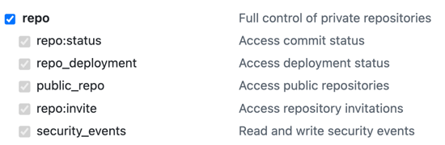

# Hello Self-Hosted Runner Online Checker 👋

이것은 셀프 호스팅 러너가 온라인 상태인지 확인하는 간단한 GitHub Action입니다.

## 입력

- `runner-labels`: (선택 사항) 확인할 러너의 레이블입니다. 여러 개의 러너가 있는 경우 확인하려는 러너의 레이블을 지정할 수 있습니다. 모든 러너를 확인하려면 `all` 또는 공백을 사용하세요.
- `include-organization-runners`: (선택 사항) 조직 러너를 확인하려면 이 값을 `true`로 설정하세요. 기본값은 `false`입니다. (실험적 기능)
- `GITHUB_TOKEN`: (필수) 인증에 사용할 GitHub 토큰입니다.
  - `repo:full` (저장소 러너만 확인하려는 경우)
    
  - `admin:org.manager_runner`: 조직 러너 관리 (조직 러너를 확인하려는 경우) (실험적 기능)
    
    - 아직 테스트되지 않았습니다. 문제가 발생하면 알려주세요.

## 예제

```yaml
name: Runner Online Check

on: [push]

jobs:
  check-self-hosted-runner:
    runs-on: ubuntu-latest
    id: check-runner-online
    outputs:
      found: ${{ steps.check-runner-online.outputs.found }}
    steps:
      - name: 러너 온라인 확인
        id: check-runner-online
        uses: illuminarean/self-hosted-runner-online-checker@main
        with:
          runner-labels: 'self-hosted x64 my-runner'
          GITHUB_TOKEN: ${{ secrets.GITHUB_TOKEN }}

  some_another_job:
    runs-on: ubuntu-latest
    needs: check-self-hosted-runner
    if: ${{ success() && needs.check-self-hosted-runner.outputs.found == 'success' }}
    steps:
      - name: 러너가 온라인입니다
        run: echo "러너가 온라인입니다"

  some_the_other_job:
    runs-on: ubuntu-latest
    needs: check-self-hosted-runner
    if: ${{ success() && needs.check-self-hosted-runner.outputs.found == 'failure' }}
    steps:
      - name: 러너가 오프라인입니다
        run: echo "러너가 오프라인입니다"
